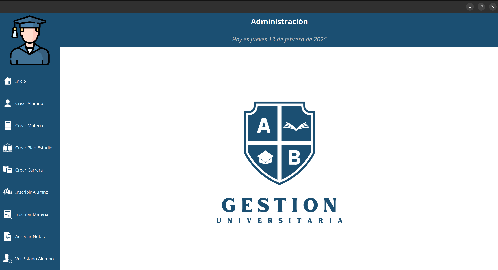

## Readme

### View Principal

### Diagrama de clases

### Modelos

- `Carrera:` La carrera esta compuesta por un nombre y  un tipo de  plan de estudio.
- `Plan de estudio:`El plan de estudio esta compuesto por un tipo de plan (A, B, C, D, E) y las materias.
- `Materias:` Las materias estan compuestas por un nombre, el cuatrimetre en el que se encuentra, un campo que verifica si es obligatoria y una lista de materias correlativas a la misma
- `Alumno:` El alumno esta compuesto por DNI para identificarlo, con un nombre y una lista de las materias aprobadas.

---
### Clases intermedias

- `InscripcionMateria:` Esta compuesta por Alumno y Materia 

---
### Funcionalidades

- `Crear plan de estudio:` se debe poder crear un plan de estudio, asignandole un tipo de plan y las materias.
- `Crear carrera:` se debe poder crear una carrera, asignandole un nombre y un tipo de plan de estudio.
- `Crear materia:` se debe poder crear una materia, asignandole un cuatrimestre, asignandole un nombre, si es obligatoria o no y si tiene materias correlativas.
- `Inscribir a carrera:` se debe poder inscribir un alumno a una carrera.
- `Inscribir a materia:` se debe poder inscribir a materias, eligiendo la carrera para elegir las materias que le correspondan.
- `Cargas notas:` se debe poder cargar si un alumno aprobo o promociono( si promociona no hay que verificar el final ) la cursada de la materia, y si aprobo el final.
- `Verificar si un alumno se graduo:` el sistema debe verificar si el alumno finalizo todas las materias obligatorias y la cantidad de materias optativas necesarias.

---

## Patrones
  
  - Patron MVC
  - Patron observer: este patron fue utilizado para actualizar las materias dinamicamente
    en sus vistas correspondientes.
  - Patron strategy: utilizado para los distintos planes de estudio

