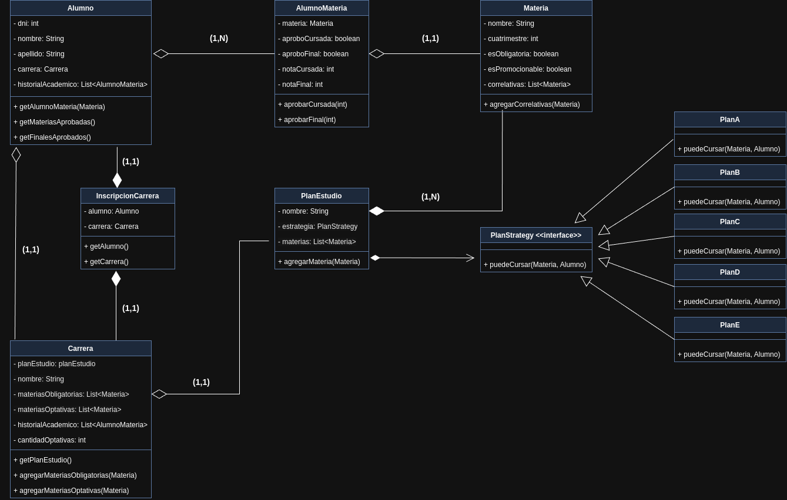

## Readme

### View Principal

### Diagrama de clases

---
### Funcionalidades

- `Crear alumno` se puede crear un alumno
- `Crear materia:` se puede crear una materia, asignandole un cuatrimestre, un nombre, si es obligatoria o no y si tiene materias correlativas.
- `Crear plan de estudio:` se puede crear un plan de estudio, asignandole un tipo de plan y las materias.
- `Crear carrera:` se puede crear una carrera, asignandole un nombre y un plan de estudios.
- `Inscribir a carrera:` se puede inscribir un alumno a una carrera.
- `Inscribir a materia:` se puede inscribir a materias, eligiendo la carrera para elegir las materias que le correspondan.
- `Cargas notas:` se puede cargar si un alumno aprobo o promociono la cursada de la materia, y si aprobo el final.
- `Verificar si un alumno se graduo:` el sistema verifica si el alumno finalizo todas las materias obligatorias y la cantidad de materias optativas necesarias.
Además, imprime toda la información actual del alumno, incluyendo carrera que está cursando y materias inscriptas.

---

## Patrones
  
  - *Patron MVC*: model view controller estandar para mayor control y orden del codigo.
  - *Patron observer*: fue utilizado para actualizar las materias dinamicamente en sus vistas correspondientes.
  - *Patron strategy*: utilizado para los distintos planes de estudio

